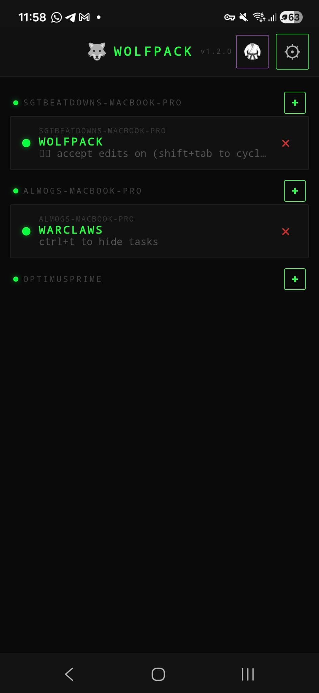
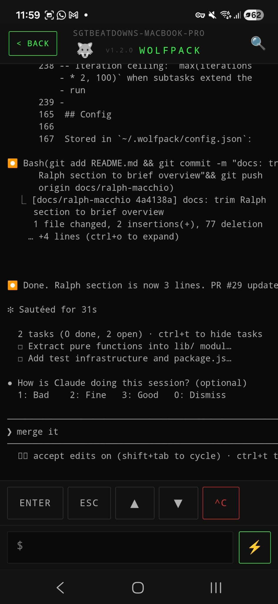
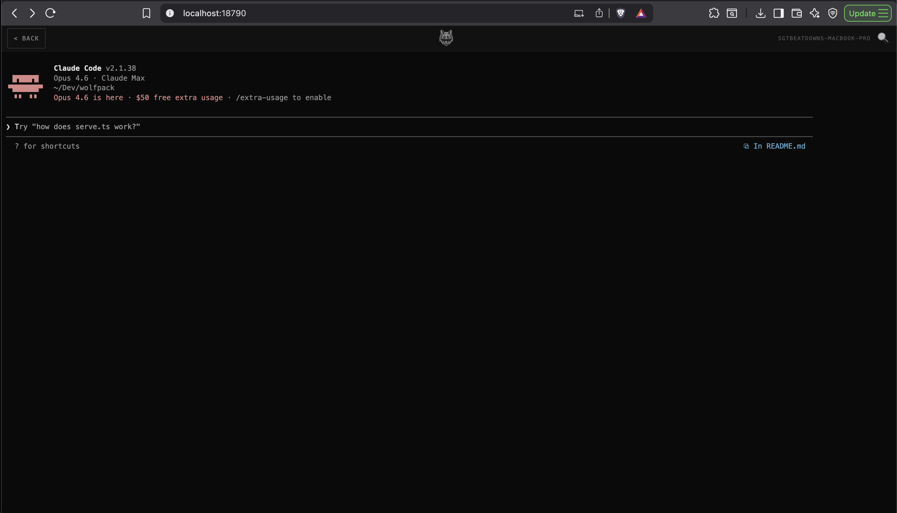

# Wolfpack

```
        ...:.
           :=+=:
       . .-*####+-
      .- :++**####*=.
       -  :+***#####*=:.
       :   .+**######*+==++++++=:..
       ..   .=*#######*++++====+=--=-.
       .:.-    -+**######**+*#*+=-:-===:
     -.  ..     -++++***#**++*#*--:---===:
     -.:--==+=--=*++*+**********+==------++-
     .:----=++*++##########******+=====--=+#=-.
       .::-----=++*#%%%%%%#***###*+===--==+*=++=:.
         ...::::-=+*#%%############*+-----===+****+=:.
          :--=-====+******++****##***-.::--++*######**
         .++-+++++***********#*+*#***=.:---=+**=--=+==
         -**++*++****+***##*++*****++=. ----=+=.  ..:-
        .+##***+*+*****##*#=-=**=-=-::. -**-::-==+++++
        :*%%*+=+=+****##**++****+**+-.. -*=-   .::::-=
        .-#%#*+*+**#***+++**+****+*++=--+=::-:..:...-+
         =###***=*+++++-=*=+++++-====-=:-=--:=---==---
        .:-+***+=*+++**+++===*++++=--:=  ::=::-=----++
          .+****+++++*##+***++=+*-.:--:..-===---=-:-++
          .-+###**+++*#****+=---:--==.--=:==-==:::-=++
            :####*****+++======:.. :...:::---:.=------
            .=###***+++*++++--:.:::.   :-=::.:..-:---:
             :+**++++++*++*+=-:: .. ...... ..   .:..::
```

Mobile & desktop command center for your AI coding agents. Control tmux-based agent sessions (Claude, Codex, Gemini, etc.) across multiple machines from your phone or browser via a Web App.

Agent-agnostic — run Claude, Codex, Gemini, or any custom command. Manage your AI wolfpack from anywhere — spin up sessions, send prompts, monitor output, and wrangle multiple agents all from one screen across multiple machines.

install it on your phone's home screen for a native app experience. After setup, scan the QR code with your phone and tap **"Add to Home Screen"** .

<p align="center">
  
  &nbsp;&nbsp;
  
</p>

<p align="center">
  
</p>


## Quick Install

```bash
curl -fsSL https://raw.githubusercontent.com/almogdepaz/wolfpack/main/install.sh | bash
```

The install script will:

1. Check prerequisites (tmux, Tailscale)
2. Download a pre-built binary for your platform from GitHub releases
3. Install to `~/.wolfpack/bin/` and symlink to `/usr/local/bin/`
4. On macOS: strip quarantine flags and ad-hoc codesign (requires Xcode CLI tools)
5. Replace any stale `wolfpack` binary already on PATH
6. Run the interactive setup wizard

Supported platforms: macOS (Apple Silicon, Intel), Linux (x64, arm64).

## Prerequisites

- **tmux**
- **Tailscale** (required) — install from [tailscale.com/download](https://tailscale.com/download), sign in, and make sure both your computer and phone are on the same tailnet

No Node.js or npm required — wolfpack ships as a standalone binary.

## Workflow

Wolfpack is opinionated. It assumes you keep your projects in a single directory (`~/Dev` by default) and that each AI agent session maps to one project folder.

**The loop:**

1. Open Wolfpack on your phone
2. Tap **+ New Session** — pick an existing project or create a new one
3. Wolfpack starts a tmux session in that project's directory and launches your configured agent (Claude, Codex, etc.)
4. You interact with the agent from your phone — send prompts, approve actions, answer questions
5. When done, kill the session or leave it running for later

**Key assumptions:**

- Sessions are scoped to project directories, but you can have multiple sessions per project
- Sessions live in tmux — they persist if you close the app or lose connection
- The projects directory is the source of truth for what you can launch sessions against
- You pick the agent command once in settings, and every new session uses it
- This is a control surface, not a full terminal emulator — it's built for the back-and-forth of AI coding, not for running vim

## How It Works

```
Phone (Web App) ←→ Tailscale HTTPS ←→ wolfpack server (HTTP) ←→ tmux sessions
```

- Server uses `tmux capture-pane` to snapshot terminal output
- Client polls every 500ms for updates (100ms after recent input)
- Text input and key presses are sent via `tmux send-keys`
- Tailscale provides encrypted transport and DNS — no port forwarding needed
- **Tailscale is the security layer.** The server has no built-in authentication — only devices on your tailnet can reach it. Do not expose the port to the public internet.

## Usage

```bash
wolfpack                    # Start the server (runs setup on first launch)
wolfpack setup              # Re-run the setup wizard
wolfpack service install    # Auto-start on login (launchd / systemd)
wolfpack service stop       # Stop the background service
wolfpack service start      # Start the background service
wolfpack service status     # Check if running
wolfpack service uninstall  # Remove the launch agent
wolfpack uninstall          # Remove everything (service, config, global command)
```

## Setup Wizard

On first run, `wolfpack` walks you through:

1. Checking prerequisites (tmux, Tailscale)
2. Setting your projects directory (default: `~/Dev`)
3. Choosing a port (default: `18790`)
4. Enabling Tailscale HTTPS access
5. Optionally installing as a login service
6. Displaying a QR code to scan with your phone

## Features

- **Session management** — View, create, and kill tmux agent sessions
- **Live terminal** — Capture-pane polling gives you a real-time terminal view
- **Project picker** — Start new sessions from any folder in your projects directory
- **Agent picker** — Choose agent per session (Claude, Codex, Gemini, or custom commands)
- **Terminal controls** — Enter, Escape, arrow keys, kill session button for TUI interaction
- **Search** — Find text in terminal output with match navigation
- **Notifications** — Browser notifications and vibration when a session needs attention (prompts, errors)
- **Session status** — Color-coded dots show which sessions need input
- **Auto-resize** — Tmux pane resizes to match your phone screen
- **Multi-machine** — Connect one phone to multiple Wolfpack servers across different computers
- **Web App** — Install as a standalone app on your phone's home screen (PWA)
- **Reconnect handling** — Shows status when connection drops, auto-recovers

## Remote Access

To control your agents from your phone:

1. Install [Tailscale](https://tailscale.com/download) on both your computer and phone
2. Sign in to the same Tailscale account on both devices
3. Run `wolfpack setup` and say **y** to "Enable Tailscale HTTPS access?"
4. Wolfpack displays a QR code — scan it with your phone's camera
5. Tap **"Add to Home Screen"** to install the app (see [Install as App](#install-as-app))

Your phone connects over Tailscale's encrypted network. No ports to open, no DNS to configure — it just works anywhere both devices have internet.

## Multi-Machine Support

You can connect one phone to multiple computers running Wolfpack. Sessions from all machines appear in a single grouped view with online/offline status indicators.

**Setup:**

1. Install and run Wolfpack on each machine (`curl` install + `wolfpack setup`)
2. Make sure all machines and your phone are on the same Tailscale network
3. On your phone, open Wolfpack and go to **Settings**
4. Tap **Add Machine** and either scan the QR code from the other machine's setup or paste its URL (e.g. `https://other-machine.tailnet-name.ts.net`)
5. The new machine's sessions appear in the session list, grouped by machine name

Each machine runs its own independent Wolfpack server with its own projects directory and config. Your phone fetches sessions from all registered machines in parallel and routes commands to the correct server.

## Config

Stored in `~/.wolfpack/config.json`:

```json
{
  "devDir": "/Users/you/Dev",
  "port": 18790,
  "tailscaleHostname": "your-machine.tailnet-name.ts.net"
}
```

Agent command and settings stored in `~/.wolfpack/bridge-settings.json`.

## Building from Source

Requires [Bun](https://bun.sh/) (v1.2+).

```bash
git clone https://github.com/almogdepaz/wolfpack.git
cd wolfpack
bun install
bun run scripts/build.ts
```

This generates the embedded asset bundle (`public-assets.ts`) and compiles binaries for all supported platforms (linux-x64, linux-arm64, darwin-x64, darwin-arm64) into `dist/`.

For local development without compiling:

```bash
bun install
bun run scripts/gen-assets.ts   # generate embedded assets (required once)
bun run cli.ts                  # start the server
```

## License

MIT
