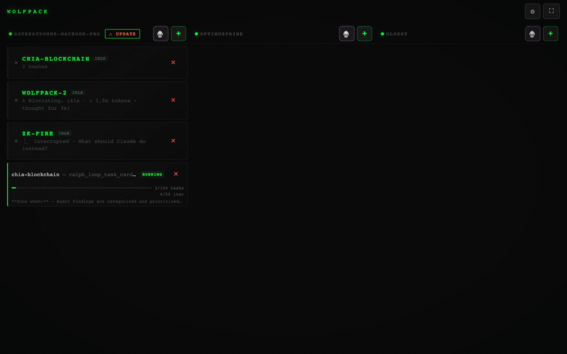
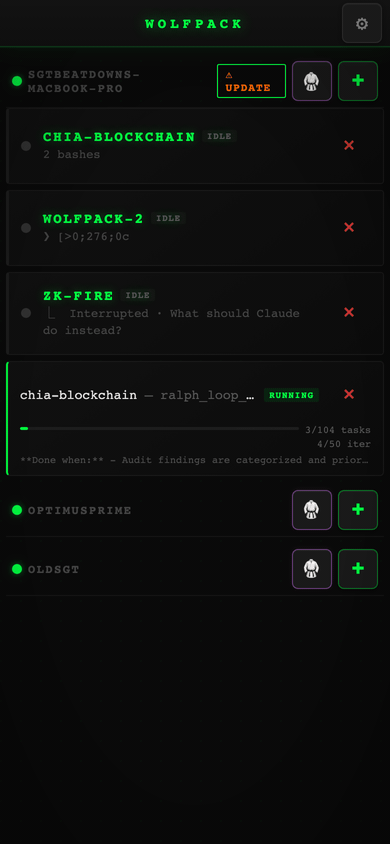

# Wolfpack

[](https://github.com/almogdepaz/wolfpack/actions/workflows/test.yml)
[](LICENSE)
[]()
[](https://github.com/almogdepaz/wolfpack/releases)

```
        ...:.
           :=+=:
       . .-*####+-
      .- :++**####*=.
       -  :+***#####*=:.
       :   .+**######*+==++++++=:..
       ..   .=*#######*++++====+=--=-.
       .:.-    -+**######**+*#*+=-:-===:
     -.  ..     -++++***#**++*#*--:---===:
     -.:--==+=--=*++*+**********+==------++-
     .:----=++*++##########******+=====--=+#=-.
       .::-----=++*#%%%%%%#***###*+===--==+*=++=:.
         ...::::-=+*#%%############*+-----===+****+=:.
          :--=-====+******++****##***-.::--++*######**
         .++-+++++***********#*+*#***=.:---=+**=--=+==
         -**++*++****+***##*++*****++=. ----=+=.  ..:-
        .+##***+*+*****##*#=-=**=-=-::. -**-::-==+++++
        :*%%*+=+=+****##**++****+**+-.. -*=-   .::::-=
        .-#%#*+*+**#***+++**+****+*++=--+=::-:..:...-+
         =###***=*+++++-=*=+++++-====-=:-=--:=---==---
        .:-+***+=*+++**+++===*++++=--:=  ::=::-=----++
          .+****+++++*##+***++=+*-.:--:..-===---=-:-++
          .-+###**+++*#****+=---:--==.--=:==-==:::-=++
            :####*****+++======:.. :...:::---:.=------
            .=###***+++*++++--:.:::.   :-=::.:..-:---:
             :+**++++++*++*+=-:: .. ...... ..   .:..::
```

Mobile & desktop command center for AI coding agents. Control tmux-based sessions (Claude, Codex, Gemini, or any custom command) across multiple machines from your phone or browser. Secured by [Tailscale](https://tailscale.com/) — zero-config encrypted access, no ports to open.

Install on your phone's home screen for a native app experience — scan the QR code after setup and tap **"Add to Home Screen"**.

<p align="center">
  
</p>
<p align="center">
  
</p>

## Architecture

```
┌─────────────┐      ┌───────────┐      ┌──────────────────────────────────┐
│   Phone /   │      │ Tailscale │      │          Your Machine            │
│   Browser   │◄────►│  (HTTPS)  │◄────►│                                  │
│   (PWA)     │      │  mesh VPN │      │  ┌──────────┐ ┌──────┐ ┌─────┐  │
└─────────────┘      └───────────┘      │  │ wolfpack │ │ tmux │ │Agent│  │
                                        │  │  server  │◄│      │◄│(any)│  │
                                        │  │ HTTP/WS  │ │      │ │     │  │
                                        │  └──────────┘ └──────┘ └─────┘  │
                                        └──────────────────────────────────┘
```

**Components:**
- **PWA** — single-file vanilla JS app (~90KB), no framework. Mobile-optimized touch UI + desktop ANSI terminal
- **Server** — Bun HTTP + WebSocket. Serves embedded assets, proxies tmux via `capture-pane`/`send-keys`
- **Ralph** — detached subprocess that iterates through a markdown plan file, invoking agents per-task
- **Agents** — Claude, Codex, Gemini, or any shell command. Agent-agnostic by design

## Quick Install

```bash
bunx wolfpack-bridge
```

Or with npx:

```bash
npx wolfpack-bridge
```

Or via shell script (no Node/Bun required):

```bash
curl -fsSL https://raw.githubusercontent.com/almogdepaz/wolfpack/main/install.sh | bash
```

This will download the pre-built binary for your platform, run the setup wizard, and optionally install as a login service.

Supported platforms: macOS (Apple Silicon, Intel), Linux (x64, arm64).

### Prerequisites

- **tmux**
- **Tailscale** — install from [tailscale.com/download](https://tailscale.com/download), sign in, and make sure both your computer and phone are on the same tailnet

## Usage

```bash
wolfpack                    # Start the server (runs setup on first launch)
wolfpack setup              # Re-run the setup wizard
wolfpack service install    # Auto-start on login (launchd / systemd)
wolfpack service stop       # Stop the background service
wolfpack service start      # Start the background service
wolfpack service status     # Check if running
wolfpack service uninstall  # Remove the launch agent
wolfpack uninstall          # Remove everything (service, config, global command)
```

### Setup Wizard

On first run, `wolfpack` walks you through:

1. Checking prerequisites (tmux, Tailscale)
2. Setting your projects directory (default: `~/Dev`)
3. Choosing a port (default: `18790`)
4. Enabling Tailscale HTTPS access
5. Optionally installing as a login service
6. Displaying a QR code to scan with your phone

## Features

- **Session management** — create, view, and kill tmux agent sessions
- **Live terminal** — capture-pane polling for real-time terminal view (mobile), xterm.js PTY for desktop
- **Agent picker** — choose Claude, Codex, Gemini, or custom commands per session
- **Multi-machine** — one phone connects to multiple Wolfpack servers; sessions grouped by machine
- **Notifications** — browser notifications + vibration when sessions need attention
- **Search** — find text in terminal output with match navigation
- **PWA** — install as a standalone app on your phone's home screen
- **Reconnect handling** — auto-recovers on connection drop with status indicator
- **Auto-resize** — tmux pane resizes to match your screen

### Remote Access

1. Install [Tailscale](https://tailscale.com/download) on both your computer and phone
2. Sign in to the same Tailscale account on both devices
3. Run `wolfpack setup` and say **y** to "Enable Tailscale HTTPS access?"
4. Scan the QR code with your phone
5. Tap **"Add to Home Screen"** for the native app experience

Tailscale's encrypted mesh network handles auth and routing — no ports to open, no DNS to configure.

### Multi-Machine

1. Install Wolfpack on each machine (`bunx wolfpack-bridge` or `curl` install)
2. Ensure all machines and your phone share a Tailscale network
3. On your phone: **Settings → Add Machine** → scan QR or paste URL
4. Sessions from all machines appear in a single grouped view

## Ralph Loop

Autonomous task runner. Write a markdown plan file, pick an agent, set iterations, and let it rip. Ralph reads the plan, extracts the first incomplete task, hands it to the agent, marks it done, and moves on — implementing, testing, and committing along the way. See [full documentation](docs/ralph-macchio.md).

## Config

Stored in `~/.wolfpack/config.json`:

```json
{
  "devDir": "/Users/you/Dev",
  "port": 18790,
  "tailscaleHostname": "your-machine.tailnet-name.ts.net"
}
```

Agent command and settings stored in `~/.wolfpack/bridge-settings.json`.

## Contributing

### Dev Setup

Requires [Bun](https://bun.sh/) (v1.2+).

```bash
git clone https://github.com/almogdepaz/wolfpack.git
cd wolfpack
bun install
bun run scripts/gen-assets.ts   # generate embedded assets (required once)
bun run cli.ts                  # start the server locally
```

### Testing

```bash
bun test                             # all tests
bun test tests/unit/                 # unit tests only
bun test tests/unit/plan-parsing.test.ts  # single file
```

Tests use Bun's built-in runner. Three categories:
- `tests/unit/` — plan parsing, ralph log parsing, escaping, validation
- `tests/snapshot/` — launchd plist and systemd unit generation
- `tests/integration/` — API routes, ralph loop endpoints

### Asset Pipeline

Frontend files live in `public/`. The server doesn't serve from disk — everything is embedded:

1. Edit files in `public/` (HTML, PNG, manifest, etc.)
2. Run `bun run scripts/gen-assets.ts` — embeds them into `public-assets.ts` (binary→base64, text→string)
3. **Do NOT edit `public-assets.ts` manually** — it's auto-generated

### Building Binaries

```bash
bun run scripts/build.ts    # assets + 4 platform binaries in dist/
```

Compiles for: linux-x64, linux-arm64, darwin-x64, darwin-arm64.

### PR Conventions

- Branch off `main`
- Tests must pass (`bun test`)
- Keep PRs focused — one feature or fix per PR

## License

MIT
