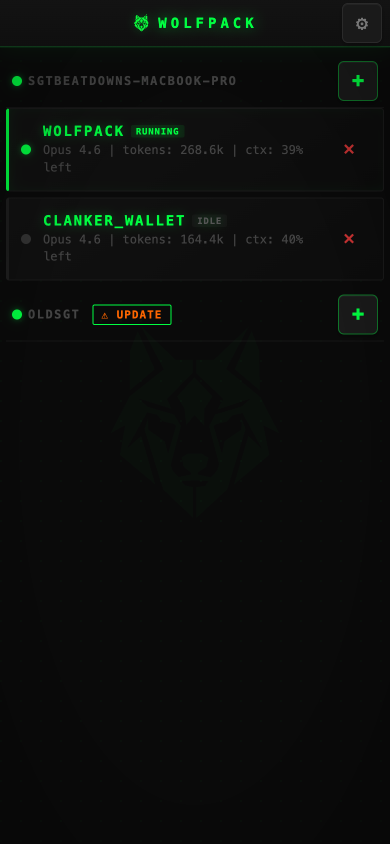

# Wolfpack — browser terminal manager for AI coding agents

[](https://github.com/almogdepaz/wolfpack/actions/workflows/test.yml)
[](LICENSE)
[]()
[](https://github.com/almogdepaz/wolfpack/releases)

Wolfpack is a self-hosted browser terminal dashboard for AI coding agents: Claude Code, Codex, Gemini, shell commands, and custom agent wrappers.
It runs on your own macOS/Linux machine — laptop, workstation, or cloud VM — and gives you a PWA command center for long-running agent terminal sessions across your Tailscale tailnet.

Sessions live in a Rust PTY broker, not the web server, so server restarts and redeploys do not kill your agents.
There is no Wolfpack-hosted relay or account; remote access is normally handled by [Tailscale](https://tailscale.com/).

<p align="center">
  
</p>
<p align="center">
  
</p>

## Quickstart

```bash
curl -fsSL https://raw.githubusercontent.com/almogdepaz/wolfpack/main/install.sh | bash
wolfpack
```

The installer downloads the right pre-built binaries for your platform, runs setup, and can install Wolfpack as a login service.
Supported: macOS arm64/x64 and Linux x64/arm64.

Want npm instead?

```bash
bunx wolfpack-bridge
# or
npx wolfpack-bridge
```

If setup gets weird, run:

```bash
wolfpack doctor
```

Uninstall is explicit:

```bash
wolfpack uninstall --yes
```

## First five minutes

1. Run the installer.
2. Choose your projects directory and port.
3. Let setup detect your Tailscale hostname and configure `tailscale serve` for HTTPS remote access.
4. Install the service when prompted if you want Wolfpack to survive login/reboots.
5. Scan the QR code, open Wolfpack on your phone, then **Add to Home Screen**.
6. Create a session and pick an agent command.

Local-only browser use works without Tailscale. Phone/remote use is where Tailscale earns its keep.

### Mobile
- **Two terminal modes** — choose in Settings:
  - **Classic** (default) — lightweight capture-pane polling. No WASM, works on all devices. Best for quick monitoring and input.
  - **Ghostty (WASM)** — full terminal emulator via [ghostty-web](https://github.com/ghostty-org/ghostty). Richer output (colors, cursor, scrollback) but heavier on battery. Keyboard is suppressed by default — tap the keyboard button to open it.
- **Keyboard accessory** — quick-action bar with Enter, Esc, arrow keys, Ctrl combos, and git status
- **Image input** — attach a photo from the camera or photo library; it's downscaled (max 1568px, JPEG) for token-efficient agent context, saved to the session's project under `.wolfpack/images/`, and its path is inserted into the message input for the agent to read
- **Touch scrolling** — momentum physics, long-press to select text and copy
- **Haptic feedback** — vibration on key actions (toggleable)
- **PWA** — install as a standalone app on your phone's home screen

## Why use it

Use Wolfpack when you want a self-hosted alternative to juggling tmux panes, SSH windows, and cloud workspaces for AI agent sessions.
It is an AI agent terminal orchestrator for developers who need persistent browser/mobile access to coding agents running on machines they control.

- **Phone-first agent control** — respond to Claude/Codex/Gemini while away from your desk.
- **Multi-machine view** — manage sessions from every machine in your tailnet, including cloud VMs.
- **Persistent PTYs** — the Rust broker owns sessions, so server restarts do not kill agents.
- **Session triage** — cards show running/idle/needs-input state and live output previews.
- **Desktop grid** — view up to 6 terminals side by side.
- **PWA UX** — install on your home screen, reconnect on drops, receive notifications when sessions need attention.
- **Agent-agnostic** — use built-in commands or add your own shell command in Settings → Agents.
- **Ralph loop** — optional autonomous plan runner. See [docs/ralph-macchio.md](docs/ralph-macchio.md).

## Agent recipes

Wolfpack starts sessions by running a command in the selected project directory.
Configure commands in **Settings → Agents**.

| Agent | Command |
| --- | --- |
| Shell | `shell` |
| Claude Code | `claude` |
| Codex | `codex` |
| Gemini | `gemini` |
| Custom wrapper | any command on `PATH`, for example `opencode` or `my-agent --flag` |

`cmd` validation intentionally rejects shell metacharacters for session commands. If you need complex setup, put it in a wrapper script on `PATH` and add that command.

## CLI

```text
wolfpack                 Start the server (runs setup on first launch)
wolfpack setup           Re-run the setup wizard
wolfpack ls              List active broker sessions
wolfpack attach [name]   Attach the local terminal to an existing session
wolfpack kill <name>     Kill a session
wolfpack session ...     Scriptable read/send/wait helpers for automation
wolfpack doctor          Diagnose broker, binaries, JWT, Tailscale
wolfpack service ...     install / start / stop / restart / status / uninstall (add --broker to include broker)
wolfpack uninstall --yes Remove everything
```

Direct terminal attach: [docs/cli-attach.md](docs/cli-attach.md). Scriptable session control: [docs/session-control.md](docs/session-control.md).

Troubleshooting: [docs/troubleshooting.md](docs/troubleshooting.md).

## Trust and security model

Wolfpack is self-hosted software for machines you control. Those machines can be local laptops, workstations, or cloud VMs.

- Browser/PWA talks to the Wolfpack server over HTTP/WebSocket.
- Remote access is normally private HTTPS through Tailscale.
- The server talks to the broker over a per-user Unix socket.
- The broker owns the PTYs and runs your selected commands locally on that machine.
- Optional JWT auth can be layered on top of Tailscale.
- Wolfpack does not provide a hosted relay, managed account, or prompt upload service.

Running coding agents is intentionally powerful: those commands execute with your local user permissions in the chosen project directory.
Treat Wolfpack access like shell access to that machine.

## Architecture

```text
┌─────────────┐    ┌───────────┐    ┌──────────────────────────────────────────┐
│   Phone /   │    │ Tailscale │    │       Your machine / cloud VM            │
│   Browser   │◄──►│  (HTTPS)  │◄──►│                                          │
│   (PWA)     │    │  mesh VPN │    │  ┌──────────┐  unix   ┌──────────────┐  │
└─────────────┘    └───────────┘    │  │ wolfpack │ socket  │  wolfpack-   │  │
                                    │  │  server  │◄───────►│   broker     │  │
                                    │  │ (Bun)    │         │  (Rust, PTY) │  │
                                    │  │ HTTP/WS  │         │  owns agents │  │
                                    │  └──────────┘         └──────────────┘  │
                                    └──────────────────────────────────────────┘
```

- **PWA** — vanilla JS, no framework. ghostty-web renders the terminal.
- **Server** — Bun HTTP + WebSocket. Pure broker client; owns no PTYs.
- **Broker** — `wolfpack-broker`, Rust daemon. Owns every PTY, keeps per-session output rings. One Unix-domain socket per host (`$XDG_RUNTIME_DIR/wolfpack-broker.sock`, fallback `~/.wolfpack/broker.sock`). Wire protocol in [docs/broker-protocol.md](docs/broker-protocol.md).

## Optional JWT auth

Tailscale already gates who can reach the server. If you want an extra auth layer on top — useful if you share your tailnet with others, or for defense-in-depth — set a JWT secret:

```bash
export WOLFPACK_JWT_SECRET="$(openssl rand -base64 48)"
```

Tokens are HS256; the server validates, it does not issue — sign them with any JWT library using the same secret.

Optional: `WOLFPACK_JWT_AUDIENCE`, `WOLFPACK_JWT_ISSUER`, `WOLFPACK_JWT_CLOCK_TOLERANCE_SEC` (default 30s).

## Config

`~/.wolfpack/config.json` (mode 0600):

```json
{
  "devDir": "/Users/you/Dev",
  "port": 18790,
  "tailscaleHostname": "your-machine.tailnet-name.ts.net"
}
```

Per-server agent settings live in `~/.wolfpack/bridge-settings.json`.

## Agent skills

Wolfpack exposes repository-local agent skills in `skills/`:

- `wolfpack-plan` — plan-file task header conventions that Ralph can parse.
- `wolfpack-ralph` — Ralph loop response contract, notifications, and sandbox/socket caveats.
- `wolfpack-tailnet-control` — discover, inspect, and control Wolfpack terminal sessions across Tailscale hosts.

Copy or symlink these skill directories into an agent's skill path when you want that agent to opt in. Installation/update details: [docs/agent-skills.md](docs/agent-skills.md).

## Contributing

See [CONTRIBUTING.md](CONTRIBUTING.md) for dev setup, the asset pipeline, and PR conventions.

Bugs and feature requests: [GitHub Issues](https://github.com/almogdepaz/wolfpack/issues). Questions and ideas: [Discussions](https://github.com/almogdepaz/wolfpack/discussions).

## License

MIT
